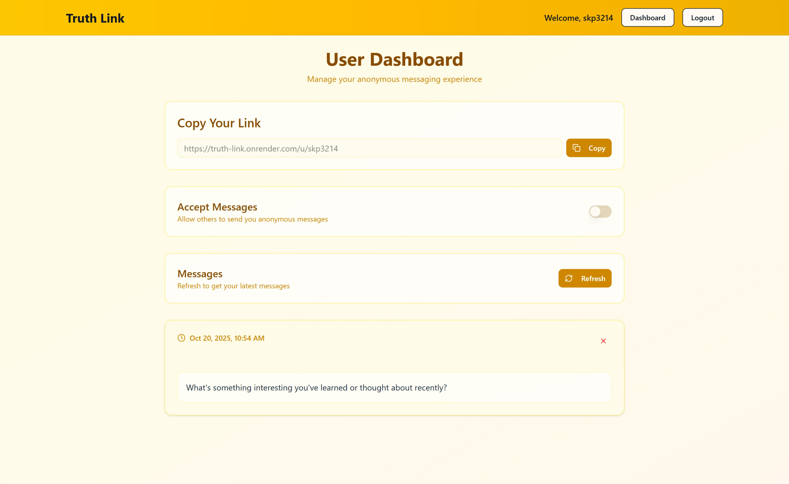
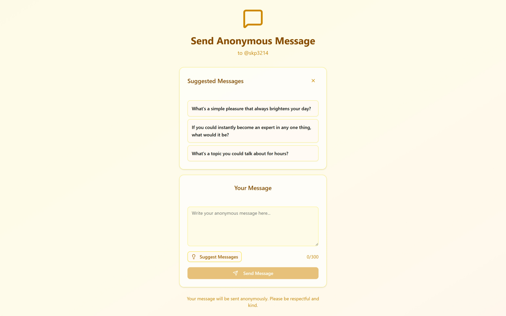

# 🔗 Truth Link [Live Link](https://truth-links.vercel.app/)

**Anonymous Messaging Platform Built with Next.js**

Truth Link is a modern, secure anonymous messaging platform that enables authentic conversations without revealing identities. Connect with others through honest, judgment-free communication.

[](https://nextjs.org/)
[](https://www.typescriptlang.org/)
[](https://www.mongodb.com/)
[](https://tailwindcss.com/)


## ✨ Features

### 🔐 **Complete Anonymity**
- Send and receive messages without revealing your identity
- Privacy-first architecture with no personal data exposure
- Secure message handling and storage

### 🚀 **Modern Tech Stack**
- **Frontend**: Next.js 15 with App Router
- **Styling**: Tailwind CSS with custom yellow-themed UI
- **Authentication**: NextAuth.js with JWT sessions
- **Database**: MongoDB with Mongoose ODM
- **Email**: Resend for verification emails
- **AI Integration**: Google Gemini for message suggestions
- **Form Handling**: React Hook Form with Zod validation

### 📧 **Email Verification System**
- Secure email verification with 6-digit OTP
- Beautiful HTML email templates using React Email
- Automatic code expiration for security

### 🤖 **AI-Powered Features**
- Smart message suggestions using Google Gemini
- Context-aware conversation starters
- Personalized message recommendations

### 📱 **Responsive Design**
- Mobile-first approach with perfect responsive design
- Dark mode support
- Elegant yellow-themed UI with smooth animations
- Accessibility-focused components

### 🛡️ **Security Features**
- Password hashing with bcryptjs
- JWT-based authentication
- Protected routes with middleware
- Input validation and sanitization
- CSRF protection

## 🚀 Quick Start

### Prerequisites

- Node.js 18+ and npm/yarn/pnpm
- MongoDB database (Atlas or local)
- Resend account for email services
- Google AI API key for message suggestions

### 1. Clone the Repository

```bash
git clone https://github.com/skp3214/truth-link.git
cd truth-link
```

### 2. Install Dependencies

```bash
npm install
# or
yarn install
# or
pnpm install
```

### 3. Environment Setup

Create a `.env.local` file in the root directory:

```env
# Database
MONGODB_URI=your-mongodb-connection-string

# Authentication
NEXTAUTH_SECRET=your-32-character-random-secret-key
NEXTAUTH_URL=http://localhost:3000

# Email Service
RESEND_API_KEY=your-resend-api-key

# AI Features
GOOGLE_GENERATIVE_AI_API_KEY=your-google-ai-api-key
```

### 4. Run the Development Server

```bash
npm run dev
# or
yarn dev
# or
pnpm dev
```

Open [http://localhost:3000](http://localhost:3000) in your browser.

## 📁 Project Structure

```
truth-link/
├── src/
│   ├── app/                    # Next.js App Router
│   │   ├── (auth)/            # Authentication routes
│   │   │   ├── sign-in/
│   │   │   ├── sign-up/
│   │   │   └── verify/
│   │   ├── (app)/             # Protected app routes
│   │   │   └── dashboard/
│   │   ├── api/               # API routes
│   │   │   ├── auth/
│   │   │   ├── send-message/
│   │   │   ├── get-messages/
│   │   │   └── suggest-messages/
│   │   ├── u/[username]/      # Public profile pages
│   │   └── page.tsx           # Landing page
│   ├── components/            # Reusable components
│   │   ├── ui/               # Shadcn/ui components
│   │   ├── MessageCard.tsx
│   │   └── Navbar.tsx
│   ├── lib/                  # Utilities and configurations
│   │   ├── dbConnect.ts
│   │   └── utils.ts
│   ├── models/               # MongoDB models
│   │   ├── user.model.ts
│   │   └── message.model.ts
│   ├── schemas/              # Zod validation schemas
│   └── types/                # TypeScript type definitions
├── emails/                   # Email templates
└── public/                   # Static assets
```

## 🎯 Core Features Walkthrough

### 🔑 **User Authentication**
- **Sign Up**: Create account with email verification
- **Sign In**: Secure login with username/email
- **Verification**: 6-digit OTP sent via email
- **Session Management**: JWT-based sessions with NextAuth.js

### 💬 **Anonymous Messaging**
- **Send Messages**: Anonymous message delivery to any user
- **Receive Messages**: Dashboard to view received messages
- **Message Management**: Delete unwanted messages
- **Toggle Acceptance**: Control who can send you messages

### 🤖 **AI-Powered Suggestions**
- **Smart Suggestions**: Context-aware message recommendations
- **Conversation Starters**: General friendly message suggestions
- **Personalized Content**: AI-generated suggestions based on user input

### 📊 **User Dashboard**
- **Message Overview**: View all received messages
- **Profile Management**: Control message acceptance settings
- **Share Profile**: Copy unique profile link
- **Message Statistics**: Track your anonymous conversations

## ScreenShot




## 📝 Environment Variables Reference

| Variable | Description | Required |
|----------|-------------|----------|
| `MONGODB_URI` | MongoDB connection string | ✅ |
| `NEXTAUTH_SECRET` | JWT secret key (32+ characters) | ✅ |
| `NEXTAUTH_URL` | Application URL | ✅ |
| `RESEND_API_KEY` | Resend email service API key | ✅ |
| `GOOGLE_GENERATIVE_AI_API_KEY` | Google AI API key | ✅ |

## 🤝 Contributing

We welcome contributions! Please follow these steps:

1. Fork the repository
2. Create a feature branch: `git checkout -b feature/amazing-feature`
3. Commit your changes: `git commit -m 'Add amazing feature'`
4. Push to the branch: `git push origin feature/amazing-feature`
5. Open a Pull Request


<div align="center">

**Built with ❤️ by [Sachin Prajapati](https://github.com/skp3214)**

**Connect anonymously. Share honestly. Build genuine relationships.**

</div>
